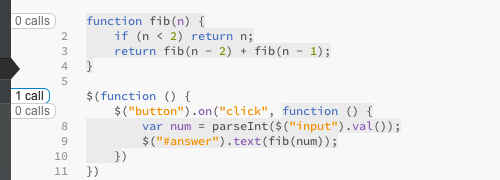

# Exploring Scope

## in Software Development Environments

---

## Inspiration

---

### Syntax Highlighting

```javascript
function myFunction(){
	alert(“Hello World!”)
};
```

---

### Context Colouring


---

### Theseus (bg colour)



---

### JSHint


---

### CSS Inspector


---

## Concepts

- Context Path
- Context Graph
- Context Colouring
- Context Inspector
- Context Gutter
- Quick Inspect

---

## Concepts

- **Context Path**
- **(Context Graph)**
- **Context Colouring**
- **Context Inspector**
- Context Gutter
- Quick Inspect

---

## Concept

- Different ways of colouring
- Highlighting context, highlighting scope
- Highlight on hover (context path)
- Indicate special vars, e.g. arguments or shadowed vars
- Indicate closures
- Configurability?

---

## Prototyping

1. Rapid prototype
  - fixed source code
  - faked state, e.g. where the cursor is
2. Real prototype
  - any source code
  - hook into JS engine
  - integration into real IDE