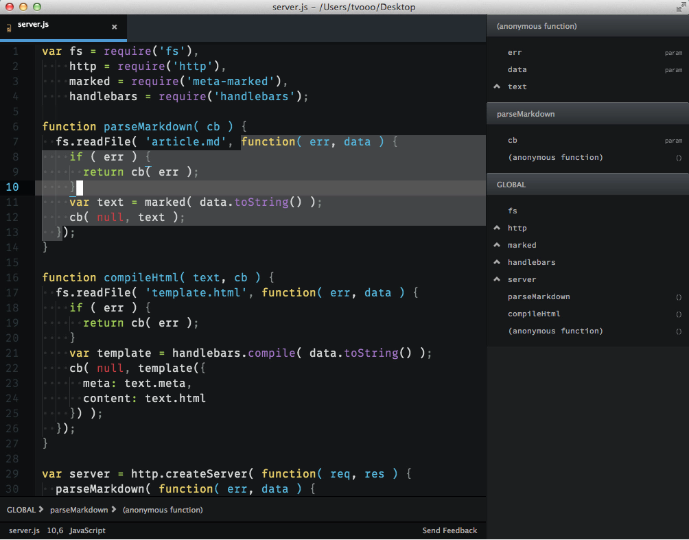
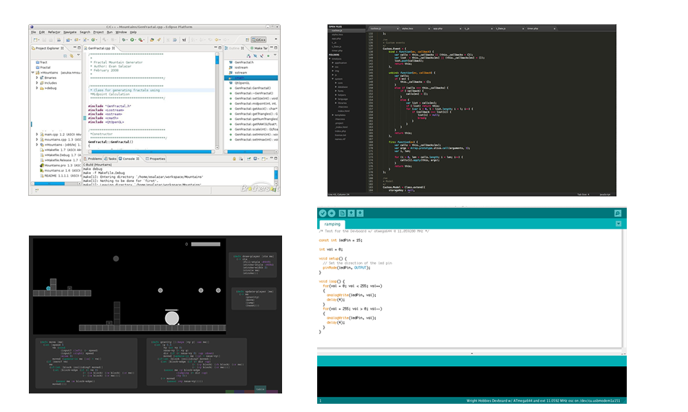
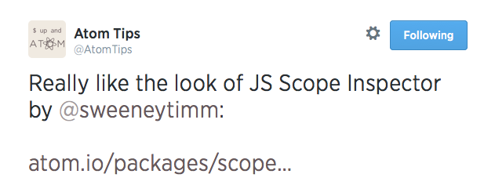
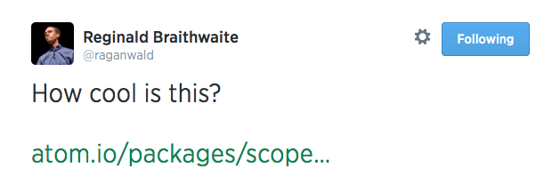
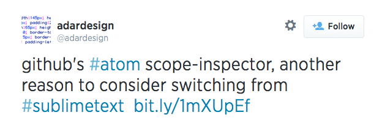
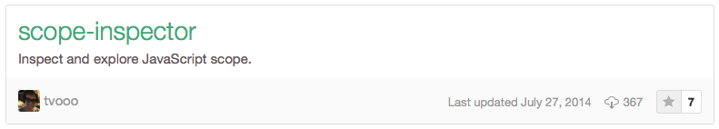
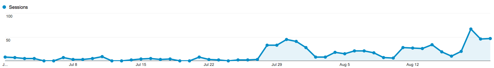

# **Making Scope Explorable** in Software Development Environments

#### by *Tim von Oldenburg*

## 

^ - Welcome to my thesis presentation
  - My thesis is entitled…
  - I have a background in computer science and I’ve worked as a software developer in the past, so I know from first-hand experience that software development is a complex and tedious process.
  - In my TP1 project I set out to make SCOPE exporable in IDEs in order to make it more accessible, and I’m gonna introduce both terms shortly

---

# Integrated Development Environments (IDEs)

IDEs integrate a code editor with different tools for software development:

* syntax highlighting
* class browser
* version control
* compiler, debugger
* …

---

# IDE Examples

^ - Like with a lot of software, IDEs exist in various forms
  - Multiple spectra: full fledged vs lightweight, general-purpose vs specialized, beginner vs expert
  - But they all have in common that they integrate different development tools, and one type of those tools are…

---

# Scope

> is *„the set of rules that determines where and how a variable (identifier) can be looked-up“* (Simpson 2014)

Different languages, different scoping models.

^ Now that is quite abstract, but we will get to it in a minute
  Those rules that Simpson mentions are different for each programming language

---

# JavaScript

### The language of the world wide web.

^ It’s ubiquituous; it’s in every web browser; it’s growing rapidly
  - I also have a lot of personal experience with JS

---

## Scope in JavaScript

Nested function scope

^ Simply put, JS has nested scope, and each function creates a new scope
  Grafik erklären: if this is your javascript program…

^ But if scope rules are so simple, why deal with it in the first place?

---

## Phenomena/Problems with Scope in JavaScript

- Shadowing
- Hoisting
- Performance
- Closure

^ Not necessarily good or bad - you just have to know what you’re dealing with!

Goal: **making the user aware of those phenomena in their code**

---

### Introducing
# JavaScript Scope Inspector

^ Plugin for the Atom editor by Github. Atom is a relatively new lightweight code editor, based on web technology. It’s easily extendable and felt like a good prototyping platform.

---

---

# Process

^ So, how did I get there?

User-Centered Design Process applied to the Open Source community.

- Exploration & Research
- Ideation
- Prototyping
- Testing

^ Before I started research, neither the specific topic nor the target user group was set
^ I knew I wanted to work with IDEs, but I needed more knowledge about the usage and painpoints of them.

---

## Survey

42 answers in 2 weeks

*Which IDE features do you use, and how would you make them better?*

---

## Interviews

7 participants, about 10 hours of interview time

---

## Result

- **Scope**
- **Characteristics of well-integrated language tools**
  * Performance
  * Modularity
  * Smartness
  * Focus on Code

---

### Working Prototype

## 

^ I’m skipping a few iterations of prototyping: sketching and a static prototype
^ Highlighting, sidebar, hoisting, shadowing

---

## Test installment

^ Atom has its own package management system, which I used to publish and distribute the prototype
  I used Twitter for marketing purposes; a few friends that have a bit more influence in the JS scene helped me get the word out
  Google Analytics was used to track usage of the prototype and of specific features
  I scheduled interviews with three users; they were meant to use the prototype one week full-time during in their real-life work.

---

## Testing results (qualitative, 1)

The scheduled test users where not available for week-long testing. Instead: **Remote contextual inquiry**.

Different users preferred different features, but all found it useful.

---

## Testing results (qualitative, 2)

Feedback (paraphrased):

*“Why can’t I navigate using the sidebar? Jump to variables?”*

*“I want to enable/disable the bottom bar and the highlighting.”*

*“It doesn’t get updated when I type.”*

---

## Testing results (quantitative)

After 1 week of tracking metrics:

**150 downloads — 5 users tracking**

---

## Social Media Feedback

---

## Reflection (1)

- Disabling **tracking by default** was hindering
- **Testing** in the open source community **is hard**, especially with a narrow user group
- Using a **small-yet-growing platform** might not be ideal for prototyping
- **Social Media** are suitable channels for “marketing and communications”

^ needs thorough planning, more time than in a more organized community

---

## Reflection (2)

“Every good work of software starts by scratching a developer's personal itch.” (Raymond 1999, paraphrased)

Interaction Design offers new impulses for the technology-driven area of development software—by *scratching other developer’s itches*.

---

## Contributions

* **Four Characteristics** of well-integrated language tools: *Performance, Modularity, Smartness, Focus on Code*
* A **case study** of evaluating a design with a specific, narrow target group
* Working **prototype** (open source)
* **Library** for scope analysis (open source)

---

# Thank you!

---

# Post-Submit

## What happened in the past three months

^ So, as you (might) know I submitted my thesis and finished my work already three months ago.

^ While I couldn’t work a lot on the project, I tried to fix the major pain points that did not take too much work.

---

## What happened in the past three months

- Minor bug fixes
- Attended to user testing feedback
  1. navigation through sidebar
  2. enable everything separately
  3. re-evaluate while typing
- Context colouring as separate plugin by third party

---

## What happened in the past three months

**Nearing 400 downloads**

---

## What happened in the past three months

^ Two months span, from beginning of July until yesterday
^ One can clearly see when I enabled metrics tracking by default

**Enabled GA tracking by default**

The sidebar is enabled on demand; Breadcrumbs are usually enabled.