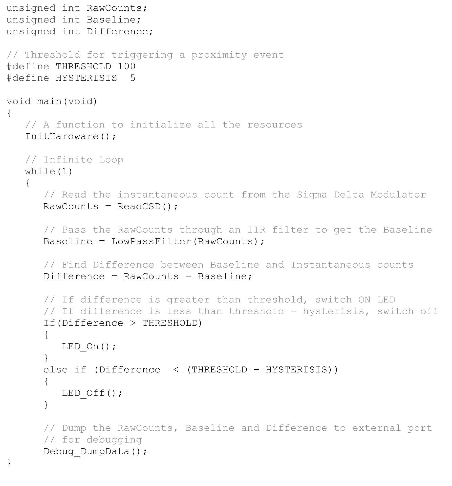
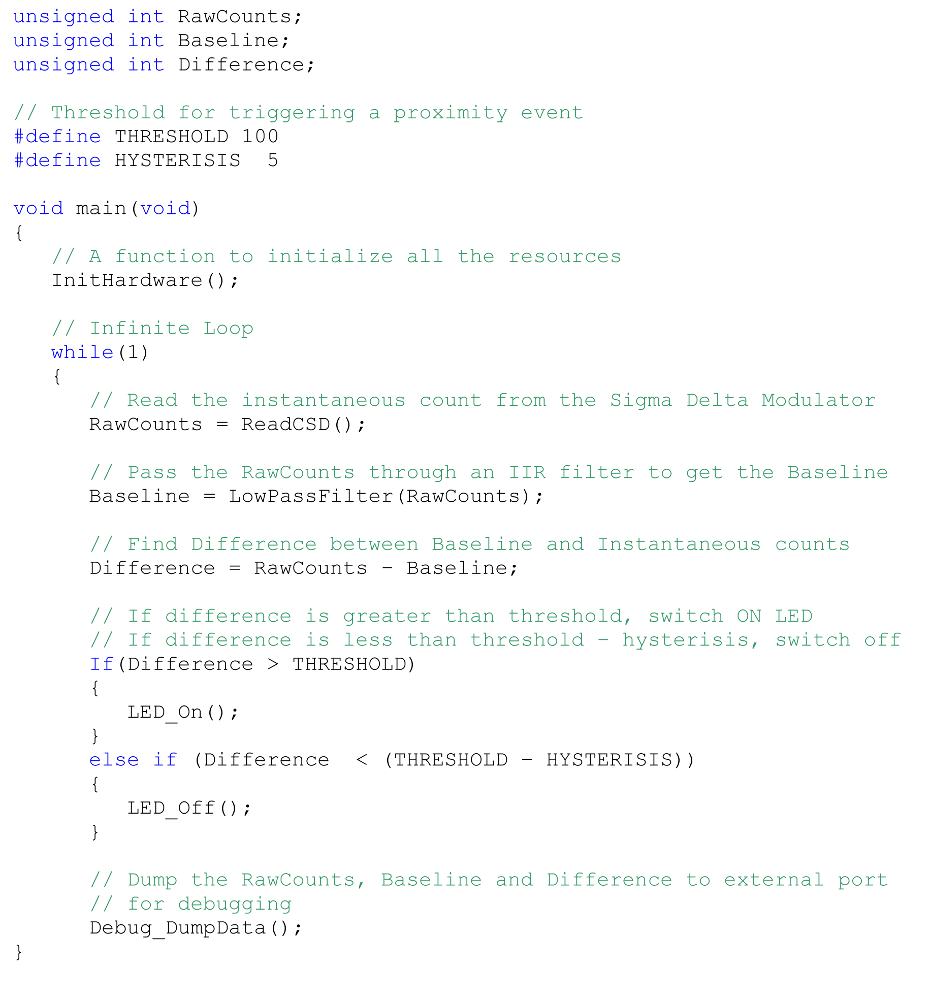
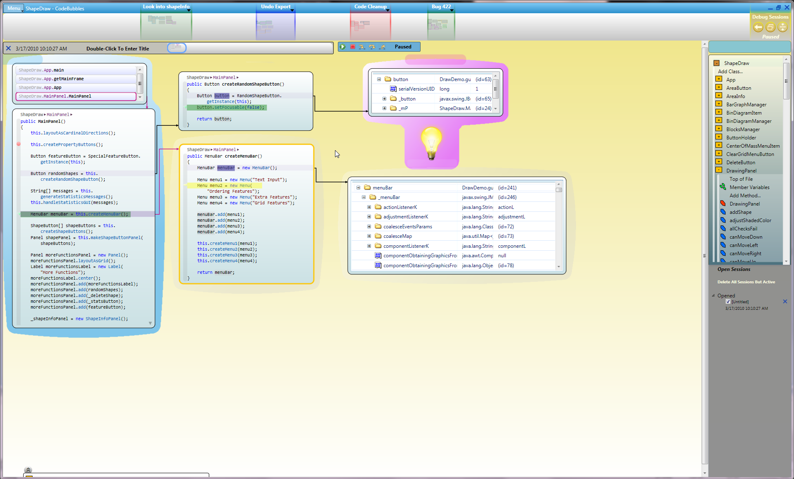
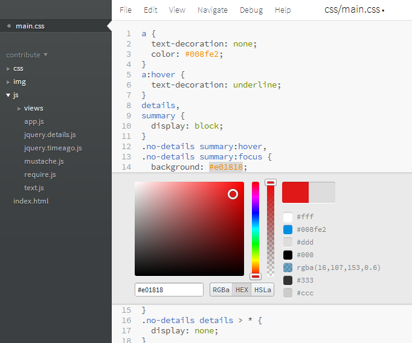
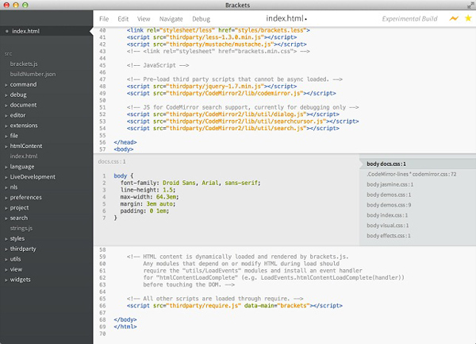
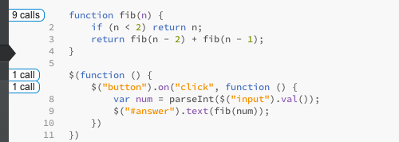
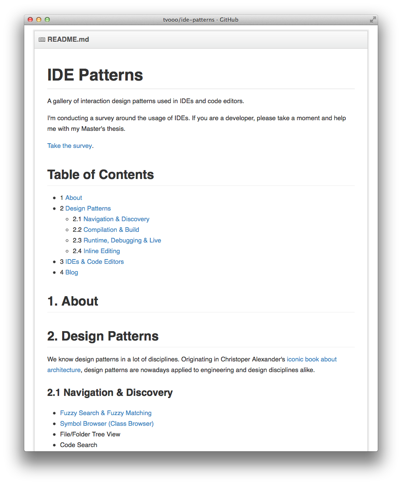

# [fit] User Interface Patterns
## to write code better

---

### How we create computer programs

# 1890 

#### Punch cards

---

### How we create computer programs

# 1955

#### Assembler over Terminal

---

### How we create computer programs

# 1975

#### High-level language on a screen

---

### How we create computer programs

# 2014

#### High-level language on a screen. With colours and stuff.

---

# Research

* Written work, existing software
* Survey
* Interviews

---

# Existing work

---

# Bret Victor

- *The Future of Programming*
- *Inventing on Principle*
- *Learnable Programming*

---

# Code Bubbles

*Code Bubbles: Rethinking the User Interface Paradigm of Integrated Development Environments*

---

# Brackets

## Inline color editing

---

# Brackets

## Quick edit

---

# Brackets

## Async debugging

*Theseus: Understanding Asynchronous Code*

---

# Light Table

Spatial representation, inline documentation

---

# Survey

## ~40 participants so far

---

# Survey

* Incredible breadth of different IDEs / code editors
* Documentation is mostly *searched for* on the web
* Autocompletion is *more or less helpful*
* Asynchronous code is *hell* and IDEs don’t help much
* Navigation of code relies on the developer’s *memory*
* Syntax highlighting has mostly a *subconscious*, visual purpose

---

# Interviews

## 4 out of 8 so far

---

# Interviews

1. Different platforms, languages & workflows require completely different tooling
2. The problem is usually *understanding*
3. The **basics** (syntax highlighting, autocompletion, browsing, searching) can still be worked on
4. Lightweight IDEs miss comfort, heavyweight IDEs are too slow

---

# Results

## Possible concept focus
- Syntax highlighting made semantic
- Autocompletion
- Visualizing asynchronicity

> »*If I'd asked customers what they wanted, they would have said ‚a faster horse‘*.«

---

# IDE Pattern Library

`github.com/tvooo/ide-patterns`

